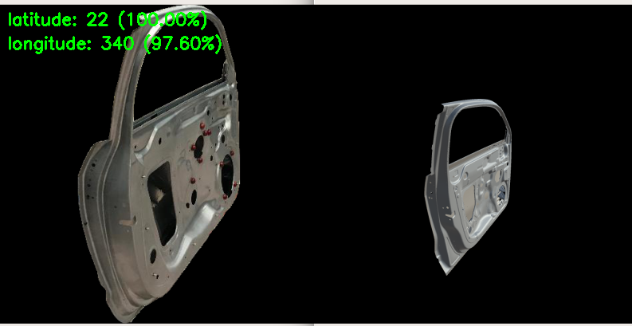
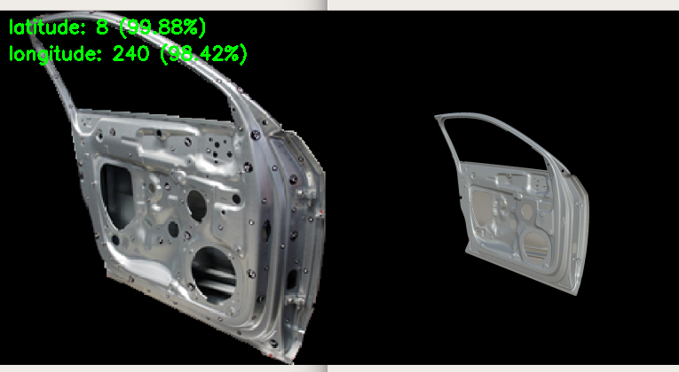
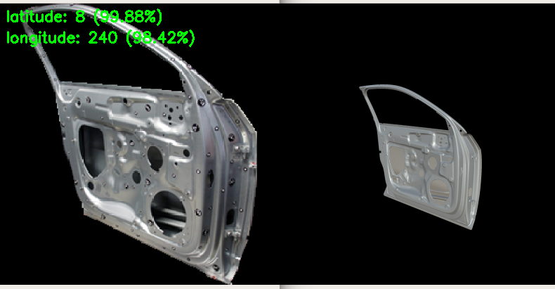

# PoseVGG

This is a PoseNet based on VGG16, which belongs to my master thesis project.
The Multi-Classification PoseNet is used for pose estimation.

  
  
Example PoseVGG output 1.

  
  
Example PoseVGG output 2.

  
  
Example PoseVGG output 3.

Thanks for your interests!

Hang Wu
